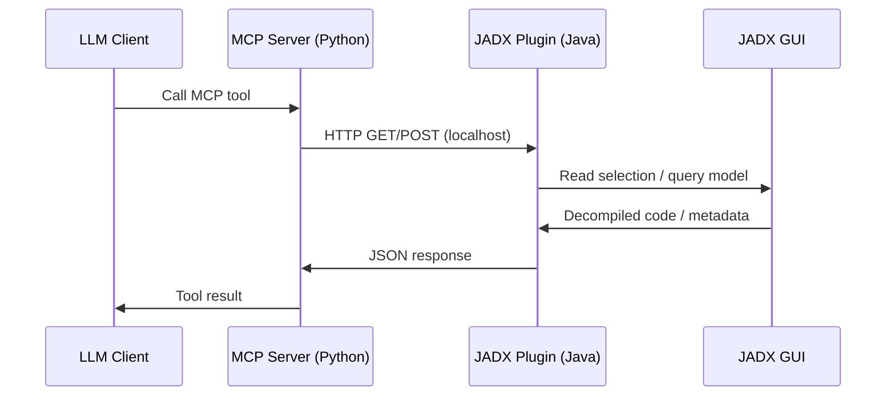

# JADX-AI-MCP

JADX-AI-MCP is an Android reverse-engineering workflow that connects JADX-GUI to LLM clients through the Model Context Protocol (MCP).

## What you get

- A **JADX GUI plugin (Java)** that exposes analysis/debug/refactor context over a local HTTP API.
- A **Python MCP server** that converts those HTTP endpoints into MCP tools (for Claude Desktop / Cherry Studio / LM Studio).

## Quick links

- [Installation](installation.md)
- [User guide](user-guide.md)
- [API reference](api-reference.md)
- [Architecture](architecture.md)
- [Examples](examples.md)
- [Troubleshooting](troubleshooting.md)

## High-level flow

## Requirements

- Java 11+
- Python 3.10+
- JADX 1.5.1+ (r2333+)
